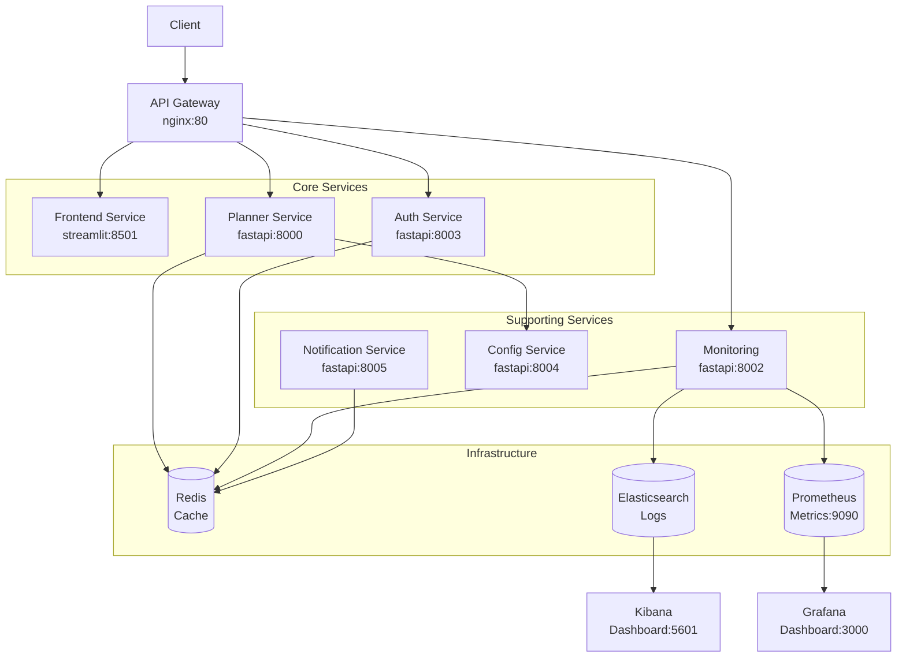

# 🚀 AI Travel Planner - Modern Microservices Architecture

[](https://opensource.org/licenses/MIT)
[](https://www.python.org/downloads/release/python-312/)
[](https://fastapi.tiangolo.com/)
[](https://www.docker.com/)
[](https://kubernetes.io/)
[](https://redis.io/)

> A production-ready, cloud-native AI Travel Planner built with modern microservices architecture, featuring comprehensive observability, security, and scalability.

## 📋 Table of Contents

- [Overview](#-overview)
- [Architecture](#-architecture)
- [Features](#-features)
- [Quick Start](#-quick-start)
- [Services](#-services)
- [Development](#-development)
- [Deployment](#-deployment)
- [Testing](#-testing)
- [Monitoring](#-monitoring)
- [API Documentation](#-api-documentation)
- [Contributing](#-contributing)
- [License](#-license)

## 🌟 Overview

The AI Travel Planner is a sophisticated microservices-based application that leverages artificial intelligence to create personalized travel itineraries. Built with modern cloud-native technologies, it provides a scalable, reliable, and secure platform for travel planning.

### Key Highlights

- **🤖 AI-Powered**: Uses LangChain and Groq for intelligent itinerary generation
- **🏗️ Microservices**: 7 specialized services for maximum scalability
- **☁️ Cloud-Native**: Kubernetes-ready with comprehensive deployment manifests
- **📊 Observable**: Full monitoring stack with ELK, Prometheus, and Grafana
- **🔒 Secure**: JWT authentication, rate limiting, and security best practices
- **⚡ High-Performance**: Redis caching and optimized async processing

## 🏗️ Architecture



### Service Architecture

| Service | Technology | Port | Purpose |
|---------|-----------|------|---------|
| **API Gateway** | Nginx | 80 | Load balancing, rate limiting, SSL termination |
| **Planner Service** | FastAPI | 8000 | Core travel itinerary generation |
| **Frontend Service** | Streamlit | 8501 | User interface and interaction |
| **Auth Service** | FastAPI | 8003 | JWT authentication and authorization |
| **Config Service** | FastAPI | 8004 | Centralized configuration management |
| **Monitoring Service** | FastAPI | 8002 | Health checks and system metrics |
| **Notification Service** | FastAPI | 8005 | Multi-channel notifications |

## ✨ Features

### 🔐 Security & Authentication
- **JWT-based authentication** with session management
- **Rate limiting** and DDoS protection
- **CORS policies** and security headers
- **Network policies** in Kubernetes
- **Secrets management** with encrypted storage

### 📊 Observability & Monitoring
- **Structured JSON logging** with ELK stack
- **Metrics collection** with Prometheus
- **Real-time dashboards** with Grafana
- **Distributed tracing** capabilities
- **Health checks** and service monitoring

### ⚡ Performance & Reliability
- **Redis caching** with configurable TTL
- **Circuit breaker** pattern implementation
- **Horizontal pod autoscaling** (HPA)
- **Load balancing** with automatic failover
- **Graceful degradation** and error handling

### 🔧 DevOps & Deployment
- **Docker containerization** with multi-stage builds
- **Kubernetes-native** deployment
- **CI/CD pipeline** with GitHub Actions
- **Infrastructure as Code** (IaC)
- **Multi-environment** support

## 🚀 Quick Start

### Prerequisites

- **Docker** and Docker Compose
- **Python 3.12+** (for local development)
- **Kubernetes cluster** (optional, for production)
- **GROQ API Key** (for AI functionality)

### 1. Clone and Setup

```bash
# Clone the repository
git clone https://github.com/rahulsamant37/ai_planner.git
cd ai_planner

# Create environment configuration
cp .env.example .env
# Edit .env with your API keys
```

### 2. Start with Docker Compose (Recommended)

```bash
# Start all services
make dev
# OR
docker-compose up -d

# View logs
make dev-logs
# OR
docker-compose logs -f
```

### 3. Access Services

| Service | URL | Description |
|---------|-----|-------------|
| **Frontend** | http://localhost:8501 | Main user interface |
| **API Gateway** | http://localhost:80 | API endpoints |
| **Grafana** | http://localhost:3000 | Metrics dashboard (admin/admin123) |
| **Kibana** | http://localhost:5601 | Log analysis |
| **Prometheus** | http://localhost:9090 | Metrics collection |

### 4. Environment Variables

```bash
# Core Configuration
GROQ_API_KEY=your_groq_api_key_here
JWT_SECRET_KEY=your_jwt_secret_key
ENVIRONMENT=development

# Optional Email Configuration
SMTP_HOST=smtp.gmail.com
SMTP_PORT=587
SMTP_USERNAME=your_email@gmail.com
SMTP_PASSWORD=your_app_password
```

## 🛠️ Services

### Core Services

#### 🧠 Planner Service (`localhost:8000`)
The heart of the application, responsible for AI-powered travel itinerary generation.

**Key Features:**
- LangChain integration for AI processing
- Redis caching for performance optimization
- RESTful API with comprehensive error handling
- Support for multiple destinations and preferences

**API Endpoints:**
```bash
GET  /health                 # Health check
POST /generate-itinerary     # Generate travel plan
GET  /cache/stats           # Cache statistics
DELETE /cache/clear         # Clear cache
```

#### 🖥️ Frontend Service (`localhost:8501`)
Interactive Streamlit web application for user interaction.

**Key Features:**
- Intuitive travel planning interface
- Real-time service health monitoring
- Cache management capabilities
- Responsive design

#### 🔐 Authentication Service (`localhost:8003`)
JWT-based authentication and user management.

**Key Features:**
- User registration and login
- JWT token management
- Session handling
- Role-based access control

**API Endpoints:**
```bash
POST /auth/login           # User authentication
POST /auth/logout          # User logout
GET  /auth/me             # Current user info
POST /auth/verify         # Token verification
```

### Supporting Services

#### ⚙️ Configuration Service (`localhost:8004`)
Centralized configuration management with feature flags.

#### 📊 Monitoring Service (`localhost:8002`)
System health monitoring and metrics collection.

#### 📧 Notification Service (`localhost:8005`)
Multi-channel notification delivery (email, SMS, webhooks).

## 💻 Development

### Local Development Setup

```bash
# Install development dependencies
make install

# Install all service dependencies
make install-services

# Start development environment
make dev

# Run tests
make test

# Code formatting
make format

# Linting
make lint
```

### Development Commands

```bash
# Quick start for new developers
make quick-start

# Run comprehensive test pipeline
make quick-test

# View service logs
make logs
make logs-planner      # Specific service logs

# Debug services
make debug-planner     # Debug planner service
make redis-cli         # Connect to Redis

# Monitor services
make monitor-health    # Check all service health
make monitor-metrics   # View system metrics
```

### Project Structure

```
ai_planner/
├── src/                          # Core business logic
│   ├── core/                     # Travel planning algorithms
│   ├── config/                   # Configuration management
│   ├── chains/                   # LangChain integrations
│   └── utils/                    # Utility functions
├── services/                     # Microservices
│   ├── api-gateway/              # Nginx gateway
│   ├── planner-service/          # Core planning service
│   ├── frontend-service/         # Streamlit UI
│   ├── auth-service/             # Authentication
│   ├── config-service/           # Configuration
│   ├── monitoring-service/       # Health monitoring
│   ├── notification-service/     # Notifications
│   └── shared/                   # Shared utilities
├── k8s/                          # Kubernetes manifests
├── monitoring/                   # Monitoring configs
├── tests/                        # Test suite
├── docker-compose.yml            # Local development
├── Makefile                      # Development automation
└── requirements.txt              # Dependencies
```

## 🚢 Deployment

### Docker Compose (Development/Testing)

```bash
# Start all services
make dev

# Stop services
make dev-stop

# Rebuild services
make dev-rebuild

# Production build
make build-prod
```

### Kubernetes (Production)

```bash
# Create namespace
make k8s-create-namespace

# Deploy to Kubernetes
make k8s-deploy

# Check deployment status
make k8s-status

# View service logs
make k8s-logs SERVICE=planner-service

# Port forward to access services
make k8s-port-forward
```

### Production Deployment

```bash
# Complete production deployment
make prod-deploy

# Rollback if needed
make prod-rollback
```

### Scaling

```bash
# Scale specific service
kubectl scale deployment planner-service --replicas=3 -n ai-planner

# Auto-scaling is configured via HPA
kubectl get hpa -n ai-planner
```

## 🧪 Testing

### Running Tests

```bash
# All tests with coverage
make test

# Unit tests only
make test-unit

# Integration tests
make test-integration

# Watch mode (auto-rerun on changes)
make test-watch
```

### Test Structure

```
tests/
├── conftest.py              # Test configuration
├── test_core.py             # Core business logic tests
└── test_planner_service.py  # API integration tests
```

### Coverage Report

```bash
# Generate HTML coverage report
pytest --cov=src --cov-report=html
# View at: htmlcov/index.html
```

## 📊 Monitoring

### Health Checks

All services provide comprehensive health endpoints:

```bash
# Check all service health
make monitor-health

# Individual service health
curl http://localhost:8000/health  # Planner
curl http://localhost:8002/system/health  # System overview
```

### Metrics and Dashboards

- **Grafana**: http://localhost:3000 (admin/admin123)
  - System Overview Dashboard
  - Service Metrics Dashboard
  - Custom Business Metrics

- **Prometheus**: http://localhost:9090
  - Raw metrics collection
  - Query interface
  - Alert configuration

- **Kibana**: http://localhost:5601
  - Log analysis and visualization
  - Custom dashboards
  - Error tracking

### Key Metrics

- Request/response times
- Cache hit/miss ratios
- Service availability
- Resource utilization
- Custom business metrics

## 📖 API Documentation

### Interactive API Docs

- **Planner Service**: http://localhost:8000/docs
- **Auth Service**: http://localhost:8003/docs
- **Monitoring Service**: http://localhost:8002/docs

### Sample API Calls

#### Generate Travel Itinerary

```bash
curl -X POST "http://localhost:8000/generate-itinerary" \
  -H "Content-Type: application/json" \
  -d '{
    "city": "Paris",
    "interests": "museums, cafes, architecture"
  }'
```

#### User Authentication

```bash
curl -X POST "http://localhost:8003/auth/login" \
  -H "Content-Type: application/json" \
  -d '{
    "username": "user@example.com",
    "password": "password123"
  }'
```

## 🤝 Contributing

We welcome contributions! Please see our [Contributing Guide](CONTRIBUTING.md) for details.

### Development Workflow

1. **Fork** the repository
2. **Create** a feature branch (`git checkout -b feature/amazing-feature`)
3. **Make** your changes
4. **Run** tests (`make test`)
5. **Format** code (`make format`)
6. **Commit** your changes (`git commit -m 'Add amazing feature'`)
7. **Push** to the branch (`git push origin feature/amazing-feature`)
8. **Open** a Pull Request

### Code Standards

- Follow **PEP 8** for Python code
- Use **type hints** where applicable
- Write **comprehensive tests**
- Update **documentation**
- Follow **semantic versioning**

## 🔧 Troubleshooting

### Common Issues

**Services not starting:**
```bash
# Check Docker daemon
docker info

# Rebuild services
make dev-rebuild
```

**Redis connection issues:**
```bash
# Check Redis status
make redis-cli
> ping
```

**Port conflicts:**
```bash
# Check what's using ports
netstat -tulpn | grep :8000
```

### Support

- 📚 [Full Documentation](FULL%20DOCUMENTATION.md)
- 🏗️ [Architecture Guide](ARCHITECTURE.md)
- 🐛 [Issue Tracker](https://github.com/rahulsamant37/ai_planner/issues)
- 💬 [Discussions](https://github.com/rahulsamant37/ai_planner/discussions)

## 📄 License

This project is licensed under the MIT License - see the [LICENSE](LICENSE) file for details.

## 🙏 Acknowledgments

- **LangChain** for AI orchestration framework
- **FastAPI** for high-performance API development
- **Streamlit** for rapid UI development
- **Groq** for fast language model inference
- **Redis** for caching and session management

---

<div align="center">
  <p><strong>Built with ❤️ by the Rahul Samant</strong></p>
  <p>⭐ Star this repo if you find it helpful!</p>
</div>